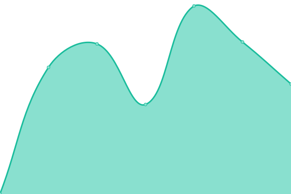
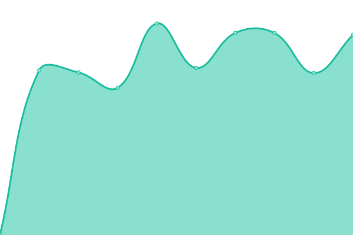
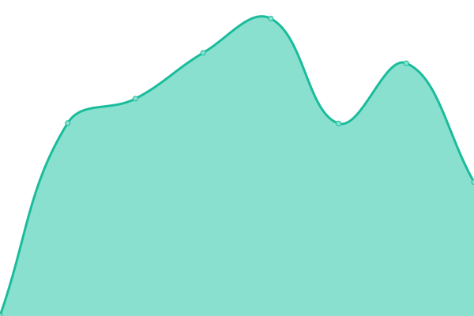

# [📈 Live Status](https://AI4EOSC.github.io/status): <!--live status--> **🟩 All systems operational**

This repository contains the open-source uptime monitor and status page for [AI4EOSC](http://ai4eosc.eu), powered by [Upptime](https://github.com/upptime/upptime).

With [Upptime](https://upptime.js.org), you can get your own unlimited and free uptime monitor and status page, powered entirely by a GitHub repository. We use [Issues](https://github.com/AI4EOSC/status/issues) as incident reports, [Actions](https://github.com/AI4EOSC/status/actions) as uptime monitors, and [Pages](https://AI4EOSC.github.io/status) for the status page.

<!--start: status pages-->
<!-- This summary is generated by Upptime (https://github.com/upptime/upptime) -->
<!-- Do not edit this manually, your changes will be overwritten -->
<!-- prettier-ignore -->
| URL | Status | History | Response Time | Uptime |
| --- | ------ | ------- | ------------- | ------ |
|  [AI4EOSC](https://ai4eosc.eu) | 🟩 Up | [ai-4-eosc.yml](https://github.com/AI4EOSC/status/commits/HEAD/history/ai-4-eosc.yml) | 

 1340ms
     
 | 

<a href="https://status.ai4eosc.eu/history/ai-4-eosc">100.00%</a>
    

|  [AI4EOSC training dashboard](https://dashboard.cloud.ai4eosc.eu) | 🟩 Up | [ai-4-eosc-training-dashboard.yml](https://github.com/AI4EOSC/status/commits/HEAD/history/ai-4-eosc-training-dashboard.yml) | 

 1061ms
     
 | 

<a href="https://status.ai4eosc.eu/history/ai-4-eosc-training-dashboard">100.00%</a>
    

|  [AI4EOSC (tutorials) training dashboard](https://tutorials.cloud.ai4eosc.eu) | 🟩 Up | [ai-4-eosc-tutorials-training-dashboard.yml](https://github.com/AI4EOSC/status/commits/HEAD/history/ai-4-eosc-tutorials-training-dashboard.yml) | 

 1169ms
     
 | 

<a href="https://status.ai4eosc.eu/history/ai-4-eosc-tutorials-training-dashboard">100.00%</a>
    

|  [AI4EOSC (dev) training dashboard](https://dashboard.dev.ai4eosc.eu) | 🟩 Up | [ai-4-eosc-dev-training-dashboard.yml](https://github.com/AI4EOSC/status/commits/HEAD/history/ai-4-eosc-dev-training-dashboard.yml) | 

 1081ms
     
 | 

<a href="https://status.ai4eosc.eu/history/ai-4-eosc-dev-training-dashboard">100.00%</a>
    

|  [iMagine training dashboard](https://dashboard.cloud.imagine-ai.eu) | 🟩 Up | [i-magine-training-dashboard.yml](https://github.com/AI4EOSC/status/commits/HEAD/history/i-magine-training-dashboard.yml) | 

 1316ms
     
 | 

<a href="https://status.ai4eosc.eu/history/i-magine-training-dashboard">100.00%</a>
    

|  [iMagine (dev) training dashboard](https://dashboard.dev.imagine-ai.eu) | 🟩 Up | [i-magine-dev-training-dashboard.yml](https://github.com/AI4EOSC/status/commits/HEAD/history/i-magine-dev-training-dashboard.yml) | 

 1106ms
     
 | 

<a href="https://status.ai4eosc.eu/history/i-magine-dev-training-dashboard">100.00%</a>
    

|  [AI4EOSC Platform API](https://api.cloud.ai4eosc.eu) | 🟩 Up | [ai-4-eosc-platform-api.yml](https://github.com/AI4EOSC/status/commits/HEAD/history/ai-4-eosc-platform-api.yml) | 

 926ms
     
 | 

<a href="https://status.ai4eosc.eu/history/ai-4-eosc-platform-api">100.00%</a>
    

|  [AI4EOSC Platform API (dev)](https://api.dev.ai4eosc.eu) | 🟩 Up | [ai-4-eosc-platform-api-dev.yml](https://github.com/AI4EOSC/status/commits/HEAD/history/ai-4-eosc-platform-api-dev.yml) | 

 849ms
     
 | 

<a href="https://status.ai4eosc.eu/history/ai-4-eosc-platform-api-dev">100.00%</a>
    

|  [AI4EOSC repository template generator](https://templates.cloud.ai4eosc.eu/) | 🟩 Up | [ai-4-eosc-repository-template-generator.yml](https://github.com/AI4EOSC/status/commits/HEAD/history/ai-4-eosc-repository-template-generator.yml) | 

 694ms
     
 | 

<a href="https://status.ai4eosc.eu/history/ai-4-eosc-repository-template-generator">100.00%</a>
    

|  [AI4OS container registry](https://registry.services.ai4os.eu/) | 🟩 Up | [ai-4-os-container-registry.yml](https://github.com/AI4EOSC/status/commits/HEAD/history/ai-4-os-container-registry.yml) | 

 960ms
     
 | 

<a href="https://status.ai4eosc.eu/history/ai-4-os-container-registry">100.00%</a>
    

|  [AI4OS NextCloud storage](https://share.services.ai4os.eu) | 🟩 Up | [ai-4-os-next-cloud-storage.yml](https://github.com/AI4EOSC/status/commits/HEAD/history/ai-4-os-next-cloud-storage.yml) | 

 933ms
     
 | 

<a href="https://status.ai4eosc.eu/history/ai-4-os-next-cloud-storage">100.00%</a>
    

|  [AI4EOSC Jenkins CI/CD system](https://jenkins.indigo-datacloud.eu/) | 🟩 Up | [ai-4-eosc-jenkins-ci-cd-system.yml](https://github.com/AI4EOSC/status/commits/HEAD/history/ai-4-eosc-jenkins-ci-cd-system.yml) | 

 1279ms
     
 | 

<a href="https://status.ai4eosc.eu/history/ai-4-eosc-jenkins-ci-cd-system">100.00%</a>
    

|  [MinIO object storage - Provider UPV/GRyCAP](https://console.minio.crazy-kowalevski5.im.grycap.net) | 🟩 Up | [min-io-object-storage-provider-upv-g-ry-cap.yml](https://github.com/AI4EOSC/status/commits/HEAD/history/min-io-object-storage-provider-upv-g-ry-cap.yml) | 

 477ms
     
 | 

<a href="https://status.ai4eosc.eu/history/min-io-object-storage-provider-upv-g-ry-cap">100.00%</a>
    

|  [OSCAR UI - Provider UPV/GRyCAP](https://inference.cloud.ai4eosc.eu) | 🟩 Up | [oscar-ui-provider-upv-g-ry-cap.yml](https://github.com/AI4EOSC/status/commits/HEAD/history/oscar-ui-provider-upv-g-ry-cap.yml) | 

 1007ms
     
 | 

<a href="https://status.ai4eosc.eu/history/oscar-ui-provider-upv-g-ry-cap">100.00%</a>
    

|  [Flowfuse AI4EOSC - Provider UPV/GRyCAP](https://forge.flows.dev.ai4eosc.eu) | 🟩 Up | [flowfuse-ai-4-eosc-provider-upv-g-ry-cap.yml](https://github.com/AI4EOSC/status/commits/HEAD/history/flowfuse-ai-4-eosc-provider-upv-g-ry-cap.yml) | 

 1241ms
     
 | 

<a href="https://status.ai4eosc.eu/history/flowfuse-ai-4-eosc-provider-upv-g-ry-cap">100.00%</a>
    

|  [Provider IFCA-LCG2 org.openstack.nova](https://api.cloud.ifca.es:5000/v3) | 🟩 Up | [provider-ifca-lcg-2-org-openstack-nova.yml](https://github.com/AI4EOSC/status/commits/HEAD/history/provider-ifca-lcg-2-org-openstack-nova.yml) | 

 418ms
     
 | 

<a href="https://status.ai4eosc.eu/history/provider-ifca-lcg-2-org-openstack-nova">100.00%</a>
    

|  [Provider NCG-INGRID-PT (INCD) org.openstack.nova](https://stratus.ncg.ingrid.pt:5000/v3) | 🟩 Up | [provider-ncg-ingrid-pt-incd-org-openstack-nova.yml](https://github.com/AI4EOSC/status/commits/HEAD/history/provider-ncg-ingrid-pt-incd-org-openstack-nova.yml) | 

 580ms
     
 | 

<a href="https://status.ai4eosc.eu/history/provider-ncg-ingrid-pt-incd-org-openstack-nova">100.00%</a>
    

|  [Provider IISAS-FedCloud org.openstack.nova](https://cloud.ui.savba.sk:5000/v3) | 🟩 Up | [provider-iisas-fed-cloud-org-openstack-nova.yml](https://github.com/AI4EOSC/status/commits/HEAD/history/provider-iisas-fed-cloud-org-openstack-nova.yml) | 

 663ms
     
 | 

<a href="https://status.ai4eosc.eu/history/provider-iisas-fed-cloud-org-openstack-nova">100.00%</a>
    

<!--end: status pages-->

[**Visit our status website →**](https://AI4EOSC.github.io/status)

## 📄 License

- Powered by: [Upptime](https://github.com/upptime/upptime)
- Code: [MIT](./LICENSE) © [AI4EOSC](http://ai4eosc.eu)
- Data in the `./history` directory: [Open Database License](https://opendatacommons.org/licenses/odbl/1-0/)
